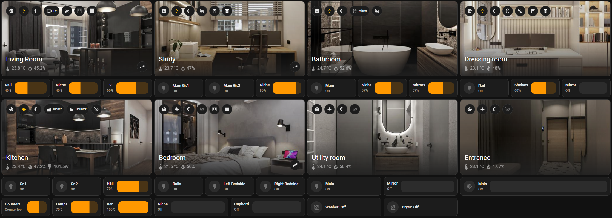
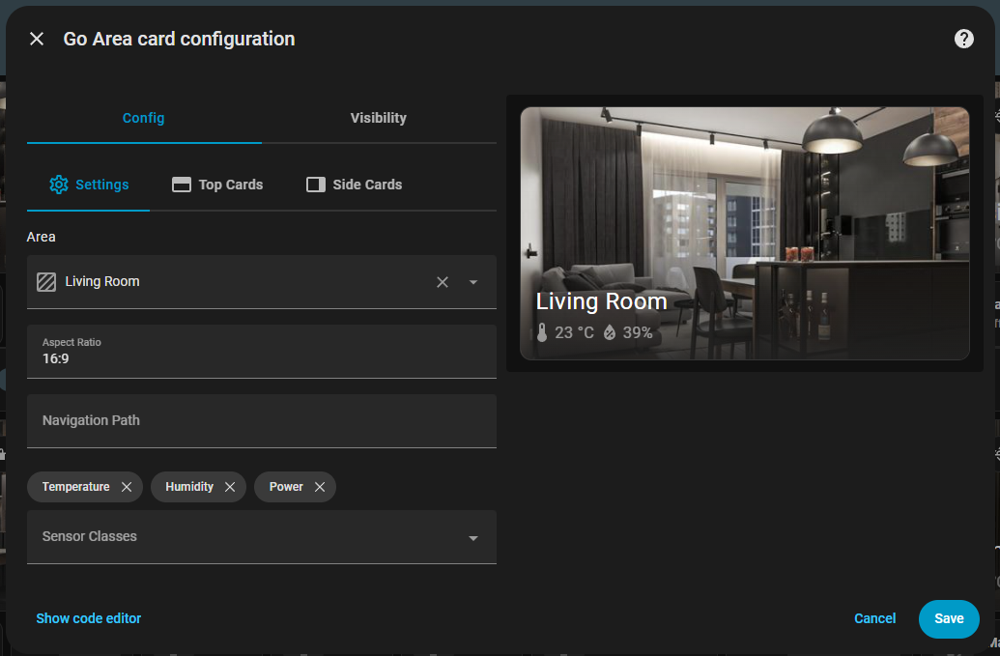

# Go Cards 🏠 Home Assistant

[](https://opensource.org/licenses/MIT)
[](https://www.home-assistant.io/)
[](https://www.typescriptlang.org/)
[](https://lit.dev/)

A collection of custom cards for Home Assistant built with TypeScript and Lit. These cards provide enhanced functionality and beautiful UI components for your Home Assistant dashboard.



## 📋 Table of Contents

- [Features](#-features)
- [Available Cards](#-available-cards)
- [Installation](#-installation)
- [Usage](#-usage)
- [Configuration](#-configuration)
- [Development](#-development)
- [Contributing](#-contributing)
- [License](#-license)

## ✨ Features

- 🎨 **Modern UI**: Beautiful, responsive card designs
- 🔧 **TypeScript**: Full type safety and IntelliSense support
- ⚡ **Lit Framework**: Fast, lightweight web components
- 🏗️ **Modular Architecture**: Easy to extend and customize
- 📱 **Mobile Friendly**: Responsive design for all devices
- 🔌 **Easy Integration**: Simple installation via HACS or manual setup
- 🧩 **Native UI Editor**: Configure every card directly from the Home Assistant UI

## 🃏 Available Cards

- 🚪[Area card](docs/cards/area/README.md)

## 🚀 Installation

### Method 1: HACS (Recommended)

1. Open HACS in your Home Assistant
3. Search for `Go Hass Cards` and click on it
4. In the page that opens click **Download**
5. Confirm and once it download click **Reload** in the popup

### Method 2: Manual Installation

1. Download the latest `go-hass-cards.js` from the [releases page](../../releases)
2. Place the file to your `www` folder in Home Assistant
3. Add the resource to your `configuration.yaml`:

```yaml
lovelace:
  resources:
    - url: /local/go-hass-cards.js
      type: module
```

4. Restart Home Assistant

## 📖 Usage example

### Area Card

Everything can be configured inside Home Assistant (no YAML needed:

1. Open a dashboard and click **⋮ → Edit Dashboard → Add card**.
2. Select **Go Area Card**.
3. Choose the area, adjust the aspect ratio, toggle sensor chips, and add multiple top/side stacks.



Prefer the raw editor? Use YAML to fine-tune or copy/paste between dashboards:

```yaml
type: custom:go-area-card
area: living_room
aspect_ratio: 16:9
sensor_classes:
  - temperature
  - humidity
  - power
top_cards:
  - type: history-graph
    entities:
      - sensor.living_room_temperature
side_cards:
  - type: entities
    entities:
      - switch.living_room_
```

Find more editor tips and advanced examples in the [Card Docs](#-available-cards).

## 🛠️ Development

### Prerequisites

- [Node.js 24+](https://nodejs.org/en/download)
- [bun](https://bun.com/docs/installation)
- Home Assistant instance for testing

### Setup

1. Clone the repository:
```bash
git clone https://github.com/go-hass/go-hass-cards.git
cd go-hass-cards
```

2. Install dependencies:
```bash
bun install
```

3. Create a `.env` file:
```bash
cp .env.example .env
```

### Development Commands

```bash
# Start development server
make dev
# or
bun run dev

# Build for production
make build
# or
bun run build

# Deploy to Home Assistant via SSH
make ssh-deploy
# or
bun run ssh-deploy

# Generate utils & types from https://github.com/home-assistant/frontend.git
make hass
# or
bun run hass
```

### Development Workflow

1. Start the development server: `make dev`
2. The server will watch for changes and rebuild automatically
3. Access your Home Assistant and add the development resource:
   ```yaml
   lovelace:
     resources:
       - url: http://localhost:8080/dev-loader.js
         type: module
   ```
4. Add a card for testing - use `custom:go-area-card-dev` as the card type
5. Refresh your browser to see changes

### Project Structure

```
src/
├── cards/                # Individual card implementations
│   ├── area-card/        # Area card components
│   └── index.ts          # Card exports
├── hass/                 # Generated Home Assistant type definitions & utilities
├── utils/                # Shared utilities
├── dev-loader.ts         # Development loader
├── go-hass-cards.ts      # Main entry point
└── types.ts              # global type definitions
```

## 🤝 Contributing

Contributions are welcome! Please feel free to submit a Pull Request. For major changes, please open an issue first to discuss what you would like to change.

### Development Guidelines

1. Follow TypeScript best practices
2. Use Lit decorators and reactive properties
3. Ensure mobile responsiveness
4. Add proper error handling
5. Include type definitions
6. Test on different screen sizes

## 📄 License

This project is licensed under the MIT License - see the [LICENSE](LICENSE) file for details.

## 🙏 Acknowledgments

- [Home Assistant](https://www.home-assistant.io/) for the amazing platform
- [Lit](https://lit.dev/) for the web components framework
- [HACS](https://hacs.xyz/) for making custom components easy to install

---

**Made with ❤️ for the Home Assistant community**
