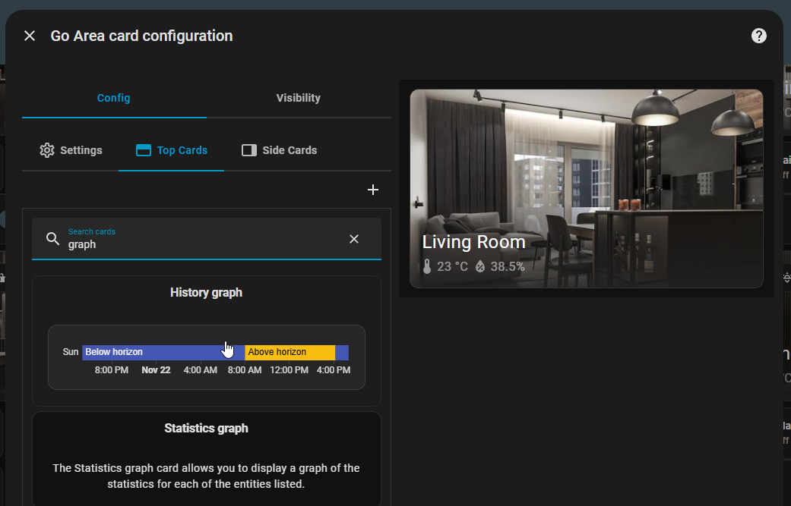
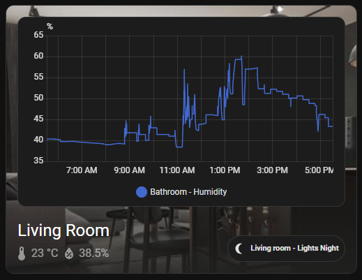

# Area Card 🏠


The Area Card provides a comprehensive overview of any area in your Home Assistant setup, displaying key sensors and information in a clean, organized layout. Perfect for monitoring living rooms, bedrooms, kitchens, or any defined area in your smart home.

## ✨ Features

- 🎯 **Area Overview**: Displays all sensors and devices within a specific area

- 📊 **Smart Sensor Detection**: Automatically detects and displays temperature, humidity, power consumption, and more

- 📐 **Flexible Aspect Ratios**: Customize the card dimensions to fit your dashboard layout

- 🎨 **Clean Design**: Modern, minimalist interface that integrates seamlessly with Home Assistant

- 📱 **Responsive**: Works perfectly on desktop, tablet, and mobile devices

- 🧩 **Native UI Editor**: Configure everything directly inside Home Assistant—no YAML required

- 🔧 **Highly Configurable**: Extensive customization options for different use cases

## 🚀 Quick Start

Configure everything directly from the Home Assistant UI:

1. Open any dashboard, click **⋮ → Edit Dashboard → Add card**.
2. Choose **Go Area Card** from the custom cards list.
3. Pick an area, tweak the aspect ratio, enable desired sensor chips, and add optional top/side stacks.







Prefer YAML or using the raw editor? You can still paste the following snippet and adjust values:

```yaml
type: custom:go-area-card
area: living_room
aspect_ratio: 16:9
sensor_classes:
  - temperature
  - humidity
  - power
```

## ⚙️ Configuration Options

| Option | Type | Required | Default | Description |
|--------|------|----------|---------|-------------|
| `area` | string | ✅ | - | Area ID to display (matches **Settings → Areas & Zones**) |
| `aspect_ratio` | string | ❌ | `16:9` | Card aspect ratio (`16:9`, `4:3`, `1:1`, `21:9`) |
| `sensor_classes` | array | ❌ | `['temperature', 'humidity', 'power']` | Sensor chips to show (values auto-detected) |
| `top_cards` | array | ❌ | `[]` | Cards rendered at the top of the card via `hui-vertical-stack-card` |
| `side_cards` | array | ❌ | `[]` | Cards rendered to the right via `hui-vertical-stack-card` |
| `navigation_path` | string | ❌ | - | Optional Lovelace path opened when the card is clicked |

## 📋 Example Configurations

### Basic Area Card
Display all default sensors for an area:

```yaml
type: custom:go-area-card
area: bedroom
```

### Custom Aspect Ratio
Perfect for wide dashboard layouts:

```yaml
type: custom:go-area-card
area: kitchen
aspect_ratio: 21:9
```

### Temperature Only
Focus on climate monitoring:

```yaml
type: custom:go-area-card
area: living_room
sensor_classes:
  - temperature
```

### Enhanced with Additional Cards
Add multiple vertical stacks for richer layouts:

```yaml
type: custom:go-area-card
area: home_office
aspect_ratio: 4:3
top_cards:
  - type: entities
    title: Quick Actions
    entities:
      - switch.desk_lamp
      - switch.monitor
  - type: custom:mushroom-chips-card
    chips:
      - type: entity
        entity: light.desk
side_cards:
  - type: history-graph
    hours_to_show: 24
    entities:
      - sensor.office_temperature
  - type: gauge
    entity: sensor.office_power
```

### Multi-Sensor Display
Show multiple sensor types:

```yaml
type: custom:go-area-card
area: garage
sensor_classes:
  - temperature
  - humidity
  - power
```

## 🎯 Supported Sensor Classes

The Area Card can display various types of sensors:

- **Climate**: `temperature`, `humidity`
- **Energy**: `power`

## 🏗️ Area Setup

To get the most out of the Area Card, ensure your devices are properly assigned to areas in Home Assistant:

1. Go to **Settings** → **Areas & Zones**
2. Create or edit your desired area
3. Assign devices to the area
4. The Area Card will automatically detect and display relevant sensors

## 💡 Tips & Best Practices

- **Aspect Ratios**: Choose `16:9` for standard displays, `21:9` for ultrawide monitors
- **Sensor Classes**: Only include sensors you actually want to monitor to keep the card clean
- **Area Organization**: Use descriptive area names and group related devices together
- **Mobile Optimization**: The card automatically adapts to mobile screens

## 🐛 Troubleshooting

**Card not displaying sensors:**
- Verify the area ID is correct and exists in Home Assistant
- Check that devices are properly assigned to the area
- Ensure sensors are in the correct state (not `unavailable` or `unknown`)

**Layout issues:**
- Try different aspect ratios if the card doesn't fit well
- Check for CSS conflicts with other custom cards

## 🔄 Updates

Stay updated with the latest features and improvements:

- Watch the repository for new releases
- Check the [main README](../../../README.md) for changelog information
- Report issues or suggest features on GitHub

---

*Need help? Check out our [main documentation](../../../README.md) or open an issue on GitHub.*
